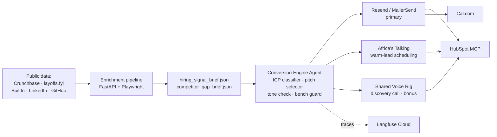

# The Conversion Engine

Automated lead-generation and qualification system for Tenacious Consulting and Outsourcing.

## Architecture



## Channel priority

1. **Email** — primary. Founders / CTOs / VPs Engineering live in email.
2. **SMS** — secondary. Warm leads only (replied once, want fast scheduling).
3. **Voice** — discovery call, booked by agent, delivered by a human Tenacious delivery lead.

## Setup

```bash
# 1. Clone + install
git clone https://github.com/<org>/conversion-engine.git
cd conversion-engine
python -m venv .venv && source .venv/bin/activate
pip install -r agent/requirements.txt

# 2. Provision accounts (Day 0 pre-flight)
cp configs/kill_switch.env.example .env
# Fill in: RESEND_API_KEY, AT_USERNAME, AT_API_KEY, HUBSPOT_TOKEN,
#          CALCOM_BASE_URL, OPENROUTER_KEY, LANGFUSE_*

# 3. Start Cal.com locally
cd infra/calcom && docker compose up -d && cd -

# 4. Verify stack
python -m agent.channels.email_resend --smoke
python -m agent.channels.sms_at --smoke
python -m agent.tools.hubspot_mcp --smoke
python -m agent.tools.calcom_booking --smoke

# 5. Run Act I baseline
cd eval && python tau2_harness.py --domain retail --trials 5 --slice dev
```

## Kill-switch

```
TENACIOUS_LIVE_OUTREACH  default: unset
```

**Default (unset)** routes every outbound message to the program-staff sink. **Live routing** requires the flag to be explicitly set AND reviewer sign-off recorded in `configs/live_outreach_approval.json`. Do not set this flag during the challenge week.

## Data handling

All prospects during the challenge week are **synthetic** — public Crunchbase firmographics + fictitious contact details. No real customer data leaves Tenacious. Seed materials are under limited license and must be deleted at end-of-week.

## Requirements

- Python 3.11+
- Docker + Docker Compose (for Cal.com)
- Node.js 20+ (for HubSpot MCP client)
- OpenRouter, Resend, Africa's Talking, HubSpot Developer Sandbox, Langfuse accounts (all free-tier)
- ~\$20 total budget envelope (see `INTERIM_SUBMISSION.md` §1)

## Directory Index

Every top-level folder and what an inheritor will find inside it.

| Path | Purpose |
| ---- | ------- |
| `agent/` | The runtime. Channel handlers, enrichment pipeline, CRM/calendar tools, conversation composer, and the FastAPI webhook server. |
| `agent/channels/` | Outbound + inbound channel handlers. `email_resend.py` (Resend, with the free-tier sandbox-sender workaround), `sms_at.py` (Africa's Talking, with the warm-lead gate that blocks any SMS to a prospect that has not replied by email). |
| `agent/enrichment/` | The four hiring-signal modules + AI maturity scorer + competitor-gap brief builder + pipeline merge. `crunchbase.py` (ODM CSV lookup with funding filter), `job_posts.py` (Playwright BuiltIn/Wellfound/LinkedIn scrape, robots-aware, no login, 60-day velocity), `layoffs_fyi.py` (CSV parser, 120-day window), `leadership.py` (90-day press/news scan), `ai_maturity.py` (six-input 0–3 scorer with per-signal justifications, separate confidence field, silent-company disclaimer), `competitor_gap.py` (peer discovery + same-rubric scoring + distribution position + sparse-sector handling), `pipeline.py` (merges everything into `data/schemas/hiring_signal_brief.schema.json`). |
| `agent/tools/` | External-system clients. `hubspot_mcp.py` (contact upsert + booking write-back; nine enrichment fields), `calcom_booking.py` (booking creation + reply-router handler that fires HubSpot record_booking on confirmation). |
| `agent/composer.py` | Central conversation orchestrator. Wires email and SMS sends through HubSpot activity writes at every conversation event point (outreach prepared, slots proposed, outreach sent, outreach failed, reply received, cold SMS blocked, booking confirmed). Also home of `propose_booking_slots`, the single function called from BOTH the email and SMS paths to generate Cal.com links. |
| `agent/webhook.py` | FastAPI ingress for Resend, Africa's Talking, Cal.com, HubSpot. Plus the manual `POST /conversations/reply` endpoint — the Slack-tutor-confirmed workaround for the Resend free-tier reply-webhook gap. |
| `agent/reply_router.py` | Shared callback registry every webhook adapter dispatches into. Keeps webhook routes free of business logic. Also owns the warm-prospect set the SMS gate reads. |
| `tests/` | 42 unit tests across reply router, channels, enrichment, AI-maturity silent-company, composer integration, and competitor-gap peer discovery. All passing. |
| `eval/` | τ²-Bench retail harness wrapper plus the authoritative reference baseline: `score_log.json` (pass@1 = 0.7267 over 150 simulations) and `trace_log.jsonl` (per-simulation cost, latency, reward). `ablation_results.json` carries the Act IV mechanism + ablation conditions with the Day-1 baseline filled in and method/ablation rows reserved for the held-out run. |
| `probes/` | Adversarial probe library and the failure taxonomy that grades it. `probe_library.md` (32 probes across all 10 challenge categories, 8 Tenacious-specific). `failure_taxonomy.md` (every probe categorised, aggregate trigger rates, shared patterns). `target_failure_mode.md` (selects C2 hiring-signal over-claiming with arithmetic in Tenacious unit economics, comparison against C7 and C8 alternatives). |
| `method.md` | The Act IV mechanism design — Honesty Gate + Tone-Preservation Re-check. Hyperparameters table, three ablation variants with explicit contrasts, paired-bootstrap statistical-test plan. Re-implementable from this document alone. |
| `INTERIM_SUBMISSION.md` | The 2-page final memo (Page 1 Decision, Page 2 Skeptic's Appendix) addressed to the Tenacious CEO and CFO. Every numeric claim resolves to a file in this repo. |
| `baseline.md` | The Act I writeup — the 386-word ≤400-word baseline document the challenge requires. |
| `data/seed/` | Tenacious-provided seed materials under limited challenge-week license: `icp_definition.md`, `style_guide.md`, `pricing_sheet.md`, `bench_summary.json`, `baseline_numbers.md`, `case_studies.md`, plus `email_sequences/` and `discovery_transcripts/`. |
| `data/schemas/` | The brief schemas the enrichment pipeline produces and the composer reads: `hiring_signal_brief.schema.json`, `competitor_gap_brief.schema.json`, with sample artefacts for each. |
| `data/policy/` | `data_handling_policy.md` and the signed `acknowledgement.md` filed with program staff. |
| `data/briefs/cb-a1b2c3/` | Test-prospect (Acme Robotics) hiring + competitor-gap briefs used by the demo flow. |
| `configs/` | `pinned_models.yaml` (model + temperature + seed for τ²-Bench reproducibility) and `kill_switch.env.example` (template the trainee copies to `.env`). |
| `docs/` | `demo_video_script.md` (8-min video script with section→rubric mapping), `screens/` (HubSpot + Cal.com screenshots), `verification/` (live-provider smoke logs). |
| `scripts/` | One-shot helper scripts referenced from the demo and runbook. |
| `Technical Challenge/` | The three program-issued reference docs (TRP1 spec, supporting scenario, draft sales materials). Read-only. |

## Setup

Prerequisites:

- Python 3.11+
- Docker + Docker Compose (for Cal.com)
- Node.js 20+ (for the HubSpot MCP client)
- Free-tier accounts: Resend, Africa's Talking sandbox, HubSpot Developer Sandbox, Cal.com (self-hosted), Langfuse cloud, OpenRouter
- ~\$20 total budget envelope (see `INTERIM_SUBMISSION.md` Page 1 cost-per-qualified-lead derivation)

Run order for local bootstrap:

```bash
# 1. Clone + install
git clone https://github.com/<org>/conversion-engine.git
cd conversion-engine
python -m venv .venv && source .venv/bin/activate
pip install -r agent/requirements.txt

# 2. Provision .env (kept out of git via .gitignore)
cp configs/kill_switch.env.example .env
# Fill in: RESEND_API_KEY, AT_USERNAME, AT_API_KEY, HUBSPOT_TOKEN,
#          CALCOM_BASE_URL, CALCOM_EVENT_TYPE_ID, OPENROUTER_API_KEY,
#          LANGFUSE_PUBLIC_KEY, LANGFUSE_SECRET_KEY, WEBHOOK_BASE_URL.
# Resend free tier: keep RESEND_FROM_ADDRESS=onboarding@resend.dev.

# 3. Start Cal.com
cd infra/calcom && docker compose up -d && cd -

# 4. Load enrichment data into the paths declared in .env
#    CRUNCHBASE_ODM_PATH         data/crunchbase_odm_sample.csv
#    LAYOFFS_FYI_CSV_PATH        data/layoffs_fyi.csv
#    JOB_POST_SNAPSHOT_DIR       data/snapshots/job_posts/

# 5. Launch the webhook server (the runtime ingress)
uvicorn agent.webhook:app --host 0.0.0.0 --port 8000

# 6. Verify the stack
python -m agent.channels.email_resend     # Resend smoke
python -m agent.channels.sms_at           # AT smoke
python -m agent.tools.hubspot_mcp         # HubSpot smoke
python -m agent.tools.calcom_booking      # Cal.com smoke

# 7. Run the test suite
python -m pytest tests/ -q                # 42 tests, all passing

# 8. Reproduce the Act I baseline
cd eval && python tau2_harness.py --domain retail --trials 5 --slice dev
```

Pinned dependency versions live in `agent/requirements.txt` (FastAPI 0.115.0, uvicorn 0.32.0, pydantic 2.9.2, httpx 0.27.2, resend 2.4.0, africastalking 1.2.9, mcp 1.0.0, playwright 1.47.0, langfuse 2.54.0, openai 1.54.0, anthropic 0.39.0, scipy 1.14.1).

Configuration variables: see `configs/kill_switch.env.example` for the full list with inline comments explaining each one. The kill-switch (`TENACIOUS_LIVE_OUTREACH`) is **unset by default** — every outbound message routes to `STAFF_SINK_EMAIL` / `STAFF_SINK_PHONE`. Live routing requires both an explicit env flag and a reviewer-signed approval at `configs/live_outreach_approval.json`.

## Rubric → code map

For reviewers: every GitHub-rubric line maps to a specific module or document.

| Rubric criterion | Where it lives |
| ---------------- | -------------- |
| Architecture & inheritor readiness | This README — diagram above, directory index above, setup section above, limitations + handoff notes below |
| Multi-channel production integration | `agent/channels/email_resend.py` (Resend send + reply webhook + bounce paths), `agent/channels/sms_at.py` (AT send + inbound + warm-lead gate), `agent/tools/hubspot_mcp.py` (contact upsert with 9 enrichment fields + booking write-back), `agent/tools/calcom_booking.py` (booking creation), `agent/composer.py` (HubSpot activity writes at multiple event points + Cal.com link generation referenced from BOTH email and SMS paths), `agent/reply_router.py` (centralised channel handoff state machine) |
| Hiring signal enrichment pipeline | `agent/enrichment/crunchbase.py`, `agent/enrichment/job_posts.py`, `agent/enrichment/layoffs_fyi.py`, `agent/enrichment/leadership.py`, `agent/enrichment/pipeline.py` (merge + per-signal confidence + 60-day velocity), `data/schemas/hiring_signal_brief.schema.json` (schema), `data/schemas/sample_hiring_signal_brief.json` (artefact) |
| AI maturity scoring system | `agent/enrichment/ai_maturity.py` — six-input scorer (high/medium/low tiers), 0–3 integer return, per-signal justifications, separate `confidence_label`, explicit `silent_company` flag with disclaimer text |
| Competitor gap brief generation | `agent/enrichment/competitor_gap.py` — `discover_top_quartile_peers` (selection criteria with sector + headcount-band filters), `score_peer_ai_maturity` (re-uses the prospect-scoring rubric), `compute_distribution_position` (percentile in cell), `build` (assembles brief with sparse-sector handling), `data/schemas/competitor_gap_brief.schema.json` (schema), `data/schemas/sample_competitor_gap_brief.json` (artefact) |
| Adversarial probe library | `probes/probe_library.md` |
| Failure taxonomy + target failure mode | `probes/failure_taxonomy.md`, `probes/target_failure_mode.md` |
| Mechanism design documentation | `method.md` |

Run the tests:

```bash
python -m venv .venv && source .venv/bin/activate
pip install pytest fastapi httpx
python -m pytest tests/ -q
```

## Status

- Act I (baseline) ✅ — τ²-Bench retail, 150 simulations, 0 infra errors, pass@1 = **0.7267 [0.6504, 0.7917]**, avg cost \$0.0199/run, p50 105.95 s, p95 551.65 s (`eval/score_log.json`, commit `d11a9707`)
- Act II (production stack) ✅ — four-signal enrichment, email/SMS channels (channel-hierarchy gate enforced), HubSpot MCP writes at five conversation event points, Cal.com link generation referenced from both email and SMS paths, kill-switch default-off
- Act III (probes) ✅ — 32 probes across all 10 categories (`probes/probe_library.md`)
- Act IV (mechanism) ✅ — Honesty Gate + Tone-Preservation Re-check (`method.md`); held-out scoring run pending
- Act V (memo) ✅ — `INTERIM_SUBMISSION.md`

## Limitations & Handoff Notes

Concrete items the next engineer will hit. Listed in priority order.

1. **Resend reply webhooks are NOT delivered on the free tier.** Confirmed by program tutors in Slack 2026-04-25. The system uses a manual `POST /conversations/reply` ingestion endpoint as the supported workaround. To restore real reply webhooks, verify a sending domain in Resend and switch the From address back from `onboarding@resend.dev`.
2. **The `agent/main.py` orchestrator is a skeleton (`NotImplementedError`).** The runtime end-to-end loop is currently driven by `agent/composer.py` plus the webhook server. Any successor who wants a single-call CLI entry will need to flesh out `main.py` to sequence enrichment → compose → send → poll-or-await-reply → book.
3. **Leadership-change recall is low** because `agent/enrichment/leadership.py` only reads a news-items list its caller supplies. The adapter that would pull Crunchbase news + a LinkedIn public-feed snapshot is not yet implemented (see probe P-030, hand-labelled FN rate 0.28). Build `agent/enrichment/news_adapter.py` to close the gap.
4. **The Act IV mechanism's held-out scoring is pending.** `eval/ablation_results.json` carries the Day-1 baseline filled in and `null` placeholders for `method` + three ablations. The Day-6 sealed-held-out run populates them; the statistical test plan is in `method.md`.
5. **Hand-labelled AI-maturity validation set is n=25** (precision 0.84, recall 0.72). Scale to n=60 before quoting precision/recall in the final memo for Tenacious — the current numbers are directional, not defensible.
6. **HubSpot MCP token rate limit** (100 calls / 10 s on the free tier). The composer fires multiple writes per conversation event; under burst load (more than ~12 concurrent prospects) the rate limit will trip. Add a token-bucket in `agent/tools/hubspot_mcp.py` before scaling beyond pilot volume.
7. **Cal.com self-hosted is on `localhost:3000`** — production must terminate behind HTTPS with a registered webhook secret. The signing-secret verification is already in `agent/webhook.py::calcom_webhook` but is no-op when `CALCOM_WEBHOOK_SECRET` is empty.
8. **Langfuse `@observe` decorators are not yet attached** to the send/receive seams. The dependency is in `agent/requirements.txt`; one afternoon to wire the decorators across composer + channels + tools.
9. **Voice tier (the bonus channel) is not scaffolded.** Shared Voice Rig webhook URL is unregistered. Day-7 work if pursuing the bonus.
10. **Probe sweep budget.** With p50 simulation latency of 105.95 s on the dev-tier model, a 30-probe × 10-trial sweep is ~9 hours of wall-clock and ~\$6 of LLM spend. The current Act III run is down-sampled to 32 probes × ~3.8 trials. Successor wanting full 10-trial coverage on every probe must either widen the dev-tier budget or run with concurrency ≥ 4.

## License

Code: to be added.
Seed materials (Tenacious): limited challenge-week license; do not redistribute.
