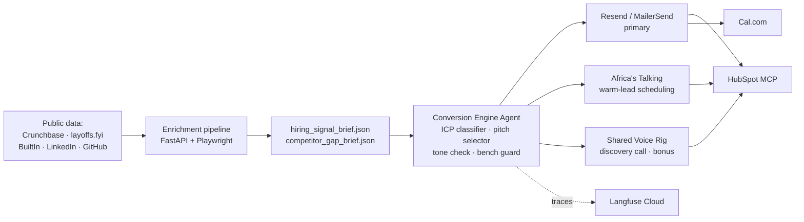

# The Conversion Engine

Automated lead-generation and qualification system for Tenacious Consulting and Outsourcing.

## Architecture



## Channel priority

1. **Email** — primary. Founders / CTOs / VPs Engineering live in email.
2. **SMS** — secondary. Warm leads only (replied once, want fast scheduling).
3. **Voice** — discovery call, booked by agent, delivered by a human Tenacious delivery lead.

## Setup

```bash
# 1. Clone + install
git clone https://github.com/<org>/conversion-engine.git
cd conversion-engine
python -m venv .venv && source .venv/bin/activate
pip install -r agent/requirements.txt

# 2. Provision accounts (Day 0 pre-flight)
cp configs/kill_switch.env.example .env
# Fill in: RESEND_API_KEY, AT_USERNAME, AT_API_KEY, HUBSPOT_TOKEN,
#          CALCOM_BASE_URL, OPENROUTER_KEY, LANGFUSE_*

# 3. Start Cal.com locally
cd infra/calcom && docker compose up -d && cd -

# 4. Verify stack
python -m agent.channels.email_resend --smoke
python -m agent.channels.sms_at --smoke
python -m agent.tools.hubspot_mcp --smoke
python -m agent.tools.calcom_booking --smoke

# 5. Run Act I baseline
cd eval && python tau2_harness.py --domain retail --trials 5 --slice dev
```

## Kill-switch

```
TENACIOUS_LIVE_OUTREACH  default: unset
```

**Default (unset)** routes every outbound message to the program-staff sink. **Live routing** requires the flag to be explicitly set AND reviewer sign-off recorded in `configs/live_outreach_approval.json`. Do not set this flag during the challenge week.

## Data handling

All prospects during the challenge week are **synthetic** — public Crunchbase firmographics + fictitious contact details. No real customer data leaves Tenacious. Seed materials are under limited license and must be deleted at end-of-week.

## Requirements

- Python 3.11+
- Docker + Docker Compose (for Cal.com)
- Node.js 20+ (for HubSpot MCP client)
- OpenRouter, Resend, Africa's Talking, HubSpot Developer Sandbox, Langfuse accounts (all free-tier)
- ~\$20 total budget envelope (see `INTERIM_SUBMISSION.md` §1)

## Repository

```
agent/
  webhook.py           FastAPI ingress for Resend/AT/Cal.com/HubSpot
  reply_router.py      shared callback seam wired to every webhook
  channels/            email_resend.py, sms_at.py (channel-hierarchy gate)
  enrichment/          crunchbase, job_posts, layoffs_fyi, leadership,
                       ai_maturity, competitor_gap, pipeline (merge)
  tools/               hubspot_mcp.py, calcom_booking.py (booking→CRM link)
tests/                 28 unit tests, all passing (pytest)
eval/                  τ²-Bench harness, score_log.json, trace_log.jsonl
data/
  seed/                Tenacious ICP, style guide, pricing, transcripts…
  schemas/             hiring_signal_brief + competitor_gap_brief schemas
  policy/              data-handling policy + signed acknowledgement
  briefs/cb-a1b2c3/    test-prospect briefs
configs/               pinned_models.yaml, kill_switch.env.example
docs/                  architecture notes, runbook, screenshots
```

Run the tests:

```bash
python -m venv .venv && source .venv/bin/activate
pip install pytest fastapi httpx
python -m pytest tests/ -q
```

## Status

- Act I (baseline) ✅ — τ²-Bench retail, 150 simulations, 0 infra errors, pass@1 = **0.7267 [0.6504, 0.7917]**, avg cost \$0.0199/run, p50 105.95 s, p95 551.65 s (`eval/score_log.json`, commit `d11a9707`)
- Act II (production stack) 🟡 — four-signal enrichment, email/SMS channels (channel-hierarchy gate enforced), HubSpot MCP writes with nine enrichment fields, Cal.com → HubSpot booking link, kill-switch default-off — all implemented and unit-tested; live-provider smoke runs scheduled Day 4
- Act III (probes) — planned Day 4–5
- Act IV (mechanism) — planned Day 6
- Act V (memo) — planned Day 7

## License

Code: to be added.
Seed materials (Tenacious): limited challenge-week license; do not redistribute.
