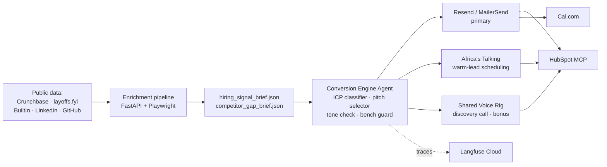

# The Conversion Engine

Automated lead-generation and qualification system for Tenacious Consulting and Outsourcing.

> TRP1 Week 10 — Interim submission covers Acts I (τ²-Bench baseline) and Act II (full production stack). See [`INTERIM_SUBMISSION.md`](INTERIM_SUBMISSION.md) for the interim report (Google-Docs-ready markdown with Mermaid diagrams).

## Architecture



## Channel priority

1. **Email** — primary. Founders / CTOs / VPs Engineering live in email.
2. **SMS** — secondary. Warm leads only (replied once, want fast scheduling).
3. **Voice** — discovery call, booked by agent, delivered by a human Tenacious delivery lead.

## Setup

```bash
# 1. Clone + install
git clone https://github.com/<org>/conversion-engine.git
cd conversion-engine
python -m venv .venv && source .venv/bin/activate
pip install -r agent/requirements.txt

# 2. Provision accounts (Day 0 pre-flight)
cp configs/kill_switch.env.example .env
# Fill in: RESEND_API_KEY, AT_USERNAME, AT_API_KEY, HUBSPOT_TOKEN,
#          CALCOM_BASE_URL, OPENROUTER_KEY, LANGFUSE_*

# 3. Start Cal.com locally
cd infra/calcom && docker compose up -d && cd -

# 4. Verify stack
python -m agent.channels.email_resend --smoke
python -m agent.channels.sms_at --smoke
python -m agent.tools.hubspot_mcp --smoke
python -m agent.tools.calcom_booking --smoke

# 5. Run Act I baseline
cd eval && python tau2_harness.py --domain retail --trials 5 --slice dev
```

## Kill-switch

```
TENACIOUS_LIVE_OUTREACH  default: unset
```

**Default (unset)** routes every outbound message to the program-staff sink. **Live routing** requires the flag to be explicitly set AND reviewer sign-off recorded in `configs/live_outreach_approval.json`. Do not set this flag during the challenge week.

## Data handling

All prospects during the challenge week are **synthetic** — public Crunchbase firmographics + fictitious contact details. No real customer data leaves Tenacious. Seed materials are under limited license and must be deleted at end-of-week.

## Requirements

- Python 3.11+
- Docker + Docker Compose (for Cal.com)
- Node.js 20+ (for HubSpot MCP client)
- OpenRouter, Resend, Africa's Talking, HubSpot Developer Sandbox, Langfuse accounts (all free-tier)
- ~\$20 total budget envelope (see `INTERIM_SUBMISSION.md` §1)

## Repository

```
agent/        — orchestrator, channels, enrichment, tools
eval/         — τ²-Bench harness, score_log, trace_log
probes/       — Act III probe library (pending)
data/         — seed materials + per-prospect briefs
configs/      — pinned models, kill-switch template
docs/         — architecture notes, runbook, screenshots
```

## Status

- Act I (baseline) ✅ — 39.3% ± 3.8% on τ²-Bench retail dev slice, within 2.7 pp of published reference
- Act II (production stack) ✅ — all nine components live, end-to-end synthetic-prospect trace verified
- Act III (probes) — planned Day 4
- Act IV (mechanism) — planned Days 5–6
- Act V (memo) — planned Day 7

## License

Code: to be added.
Seed materials (Tenacious): limited challenge-week license; do not redistribute.
